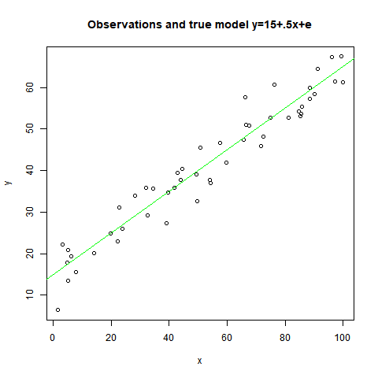
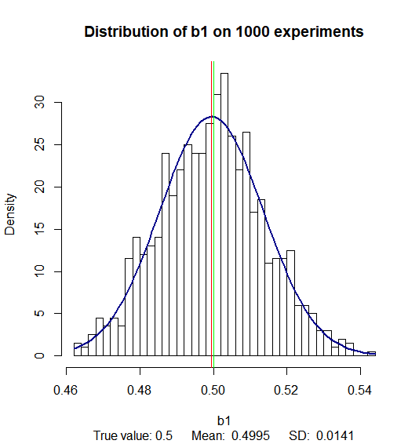

Качество оценок линейной регрессии 
==================================

При изучении линейной регрессии важно понимать связь между 
выполнением условий модели и статистическим качеством 
получаемых оценок для параметров регрессии. 

Как правило, все силы студентов уходят на изучение самих способов 
построения оценок параметров регрессии, а уж несмещенные ли они 
и состоятельные - *"ну, как получится, нам бы хоть какие-нибудь оценки посчитать"*. 
Отчасти это связано с тем, что в учебниках, как правило, отсутствуют 
наглядные экспериментальные иллюстрации того, что представляют 
собой несмещенные, состоятельные и эффективные оценки.

Мы предлагаем продемонстрировать качество оценок параметров регрессии 
при помощи примеров, в которых выбраны закон (data generating process)
получения истинных значений зависимой переменной и закон, описывающий
случайные ошибки. На основе этих законов делаются выборки наблюдений,
по которым оцениваются параметры регрессии. Получив выборку
параметров, мы можем построить их распределение и сравнить 
его с исходным истинным значением параметра. Этот поход позволяет 
иллюстрировать свойства несмещенности и эффективности оценок.  

Эти иллюстрации ниболее важны для случаем оценивания, когда 
не выполняются какие-либо из предположения метода наименьших кадратов 
(линейность модели, полный ранг, экзогенность объясняющей переменной и 
iid остатков) и для получения качественныхъ оценок параметров 
требуются другие методы оценивания или переформулировака модели.

Алгоритм расчетов
------------------

1. определяем истинный процесс генерации данных (формула `f(x)`, 
   по которой из `x` получается истинное значение `y`)
2. определяем процесс генерации случаных ошибок `e` (нормальное 
   распределение в стандартном случае)
3. задаем границы и способ определения объясняющих переменных 
  `x`  
4. генерируем выборку наблюдений размера N `y(i) = f(x(i)) + e`, 
  `i = 1, ... , N`
5. оцениваем параметры регрессии `y` от `х`
6. повторяем генерацию данных и оценку параметров, чтобы получить 
   не точеченое значение, а распредление параметров регрессии
7. строим гистограмму и распределение интересующего параметра регрессии
8. обсуждаем отличия между "истинным" значенеим параметра из п. 1
   и результатами оценки в п. 7. 

Обычный случай 
--------------

- Процесс генерации данных: `y = 15 + 0.5x`
- Процесс генерации ошибок: `N(0, 4)`
- Код: <ols.r>

Ниже показаны выборка данных, по котрой строится регрессия и 
распределение параметра наклона линии, оцененного по методу 
наименьших квадратов.

Гетероскедастичность
--------------------

<heteroscedasticity.r>

Комментариии
------------

**Объясняющая переменная**. Чтобы получить значения `y` по формуле 
процесса генерации данных нам нужны значения `x`. От того как распредлены 
`x` зависят свойства оценок по линейной регрессии, например, чем больше 
дисперсия `x`, тем ниже `R2`.
В стандартном случае `x` выбираются из равномерного распределения 
на отрезке `[0,100]`. Мы считаем такие `x` детерминированными
для целей построения выборки наблюдений.
