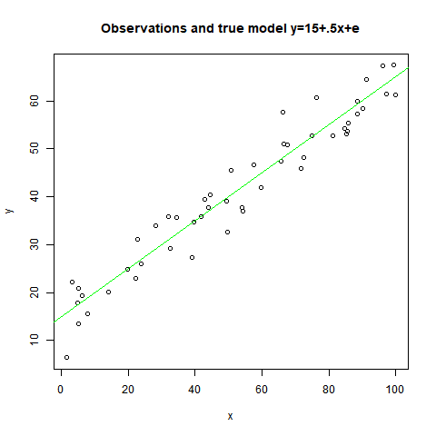
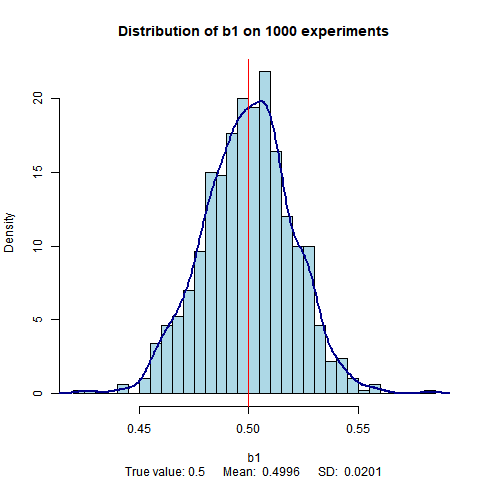
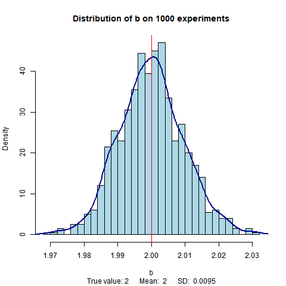
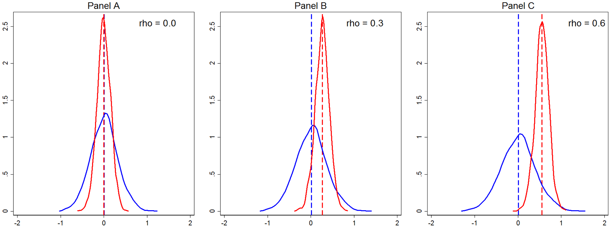

Качество оценок линейной регрессии 
==================================

В рамках лиейной регрессии мы оцениваем параметры выбранной нами
модели, связывающей зависимую и объясняющие переменные. Статистическое 
качество оцененных параметров зависит от предположений модели.  

Как правило, все силы студентов уходят на изучение самих способов 
построения оценок параметров регрессии, а уж несмещенные ли они 
и состоятельные - потом разберемся. 

Отчасти это связано с тем, что в учебниках, как правило, отсутствуют 
наглядные экспериментальные иллюстрации того, что представляют 
собой несмещенные, состоятельные и эффективные оценки для конкретных примеров.

Мы предлагаем продемонстрировать качество оценок параметров регрессии 
при помощи примеров, для которых нами заранее определен процесс
получения данных (data generating process), включающий:

- распределение объясняющих переменных X
- закон получения истинных значений зависимой переменной Y = f(x)
- закон, описывающий случайные ошибки (error process).

На основе этих законов делаются выборки наблюдений,
по которым оцениваются параметры регрессии. Повторяя выборки наблюдений 
мы можем построить эмпирические распределения параметров и сравнить 
их с исходными истинными значениями. Этот поход позволяет 
наглядно иллюстрировать свойства несмещенности и эффективности оценок.  

Наиболее важны случаи оценивания, когда не выполняются какие-либо из предположений метода наименьших кадратов (линейность модели, полный ранг, экзогенность объясняющей переменной и 
iid остатков). В этих случаях для получения качественных оценок 
параметров регрессии требуются другие методы оценивания,
переформулировка модели или трансформация переменных.

Алгоритм расчетов
------------------

1. определяем истинный процесс генерации данных - формулy `f(x)`, 
   по которой из `x` получается истинное значение `y`, эта формула содержит 
   истинные значения параметров `θ`
2. определяем процесс генерации случаных ошибок `e`, в стандартном случае
   это нормальное распределение, не зависящее от `x`
3. задаем границы и способ определения объясняющих переменных 
  `x(i)` для i-ого наблюдения  
4. генерируем выборку наблюдений размера N `y(i) = f(x(i)) + e(i)`, 
  `i = 1, ... , N`
5. оцениваем точеченое значение параметра `θ` регрессии `y` от `х` согласно 
   выбранной модели
6. повторяем генерацию выборки данных и оценку параметров, чтобы получить 
   распределения этих параметров 
7. строим гистограмму и эмпирическое распределение интересующего нас 
   параметра регрессии
8. обсуждаем отличия между истинным значением параметра из п. 1
   и результатами его оценки в п. 7., связываем  
   характеристиками процесса генерации данных (п.2,3,4).   

Обычный случай 
--------------

- Процесс генерации данных: `y = 15 + 0.5x`
- Процесс генерации ошибок: `N(0, 4)`
- Код: [ols.r](r/ols.r)

Ниже показаны выборка данных, по котрой строится регрессия и 
распределение параметра наклона линии, оцененного по методу 
наименьших квадратов.

Гетероскедастичность
--------------------

<!--

- Процесс генерации y: ...
- Процесс генерации x: ...
- Процесс генерации ошибок: ...
-->

- Код: [heteroscedasticity.r](r/heteroscedasticity.r)
- На основе: https://stats.stackexchange.com/questions/33028/measures-of-residuals-heteroscedasticity

Выводы:
- гетероскедастичность уменьшает эффективность оценки, но сохраняет несмещенность
- эмпирическое распределение оценки нужно с чем-то сравнивать, 
  у нас нет заранее истинного абсолютного значения дисперсии оценки (или есть?
  знаем ли мы по распределению ошибки распределение параметра регрессии?)

Вопрос
------

Как получить хорошие иллюстрации неэффективности МНК-оценки
с гетероскедастичностью? Как, например, [в оценке числа "пи"][pi-sas]

[pi-sas]: https://blogs.sas.com/content/iml/2016/03/14/monte-carlo-estimates-of-pi.html

Что-то наподобие рисунков ниже:

[][pi-sas]

Комментариии
------------

**Объясняющая переменная**. Чтобы получить значения `y` по формуле 
процесса генерации данных нам нужны значения `x`. От того как распредлены 
`x` зависят свойства оценок по линейной регрессии, например, чем больше 
дисперсия `x`, тем ниже `R2`.
В стандартном случае `x` выбираются из равномерного распределения 
на отрезке `[0,100]`. Мы считаем такие `x` детерминированными
для целей построения выборки наблюдений.